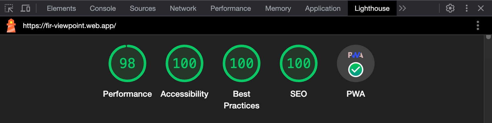

  
  <h1>Viewpoint - Personal Blog</h1>
  
<strong>Progressive Web App</strong> created with <strong>React</strong> and <strong>Firebase</strong>

  
<strong>Demo:</strong> <a href="https://fir-viewpoint.web.app">fir-viewpoint.web.app</a>

  

 

  
 Table of Contents

  <ul>
    <li><a href="#introduction">Introduction</a></li>
    <li><a href="#technologies">Technologies</a></li>
    <li><a href="#features">Features</a></li>
    <li><a href="#results">Results</a></li>
    <li><a href="#status">Status</a></li>
  </ul>

## Introduction

The main goal of the project was to create a **Progressive Web App (PWA)** that would have the reach of a web app (ability to run on any device regardless of operating system) and the capabilities of a native app, such as installability, persistence (high performance and offline mode), and more.

Another equally important goal was to connect the app with **Firebase**, which provides backend services, and configure the following features to meet my needs:

- **Firestore:** to store all data related to stories (Firestore supports offline data persistence, which is crucial for PWA development)
- **Storage:** to store all media, such as photos
- **Hosting:** to host an app using a secure connection

The last of the important goals was to implement the app following the principles of **Responsive Web Design (RWD)** and add interactions based on pointer and scroll events to give the app a more native feel.

## Technologies

The following technologies and methodologies were used in the project:

## Features

Features worth paying attention to:

#### [validateStory](src/helpers/validateStory.ts)

All data (stories) coming from the Firestore database is fetched using the [useData](src/hooks/useData.ts) custom hook. The received data is then processed in the [useStructure](src/hooks/useStructure.tsx) custom hook, where it is separated into individual sections. However, before this happens, the data must go through validation in the [validateStory](src/helpers/validateStory.ts) helper function. This function checks whether each individual value of each individual record (story) in the database is correctly defined (or defined at all). If not, the [validateStory](src/helpers/validateStory.ts) function assigns it a save value to prevent the app from crashing and prints a warning or error message to the console.

#### [modifyText](src/helpers/modifyText.ts)

Each paragraph in the app goes through the [Markdown](src/components/Markdown/Markdown.tsx) component. In this component, plain text (such as this [placeholderText](https://github.com/mcktrjn/viewpoint/blob/77abee5e5c8402e81a8b896ceca8add48fc40364/src/constants.ts#L39-L85)) is split into tags, to which [styles](src/components/Markdown/Markdown.module.scss) are then applied. However, before this happens, text must be modified by the [modifyText](src/helpers/modifyText.ts) helper function, which prevents typographic errors such as short words (conjunctions) left at the end of lines and single word left on the last line. This function splits text into an array of words, iterates through its elements, and depending on the [condition](https://github.com/mcktrjn/viewpoint/blob/77abee5e5c8402e81a8b896ceca8add48fc40364/src/helpers/modifyText.ts#L32-L33), combines words with either regular space or non-breaking space into new modified text. Simultaneously, it checks whether the current length of the modified text does not exceed the specified number of characters.

#### [Page](src/components/Page/Page.tsx)

After receiving page structure from the [useStructure](src/hooks/useStructure.tsx) custom hook, the [Page](src/components/Page/Page.tsx) component maps sections and assigns them references. These references are then passed through the [Context](src/Context.ts) file to the [App](src/App.tsx) file (root). There, information about the current positions of sections (distances from the top of the document) is extracted from references. Based on this information, the visibility of each section is calculated, that is, whether it is currently visible in the viewport. If it is, the `sectionVisibility` variable value is set to `true` and (once again through [Context](src/Context.ts)) passed back to the [Page](src/components/Page/Page.tsx) component, where it fires the section transition.

#### There is more, feel free to dive into the [code](src)

## Results

  

## Status

Work in progress
